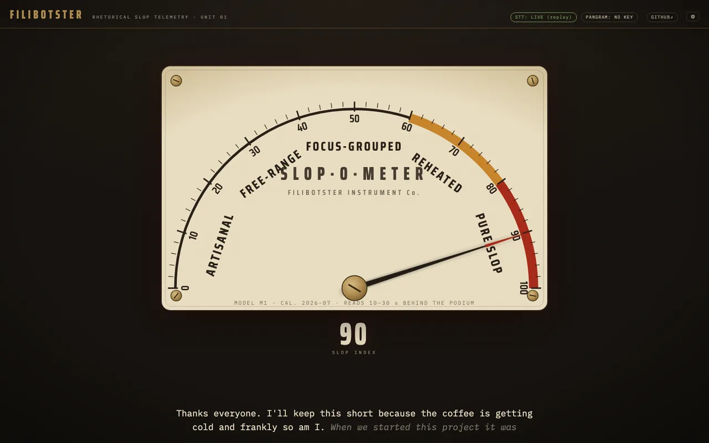
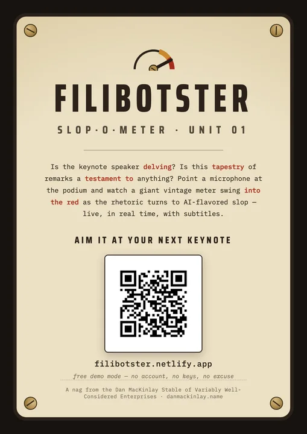

# Filibotster

[](https://filibotster.netlify.app/?demo=slop)

Live rhetorical slop telemetry for the modern podium. Point a microphone at a
speaker and project a giant vintage meter whose needle swings into the red as
their recent language reads as AI-generated slop.

**Public instance:** `https://filibotster.danmackinlay.name`
<!-- TODO: confirm URL after first Netlify deploy + domain attach -->

See [SPEC.md](SPEC.md) for the full design. Current state: **M2** — dial,
subtitles, lexical slop meter, replay demo, Pangram client + relay, and both
live-mic paths (Deepgram streaming with mic picker, Web Speech API fallback).

## Quick start (local, no keys needed)

```sh
cd app
npm install
npm run dev
```

Open the printed URL, hit **▶ REPLAY DEMO**, and watch the bundled demo speech
decay from artisanal to pure slop. **● LIVE MIC** without keys uses the
browser's built-in speech recognition — which in practice means **real Google
Chrome only**: Chromium forks (Arc, Brave, etc.) expose the API but their
recognizer fails, and the app will tell you so after a few attempts. For any
other browser, or better accuracy, bring a Deepgram key (below).

Keyboard: `f` fullscreen · `space` pause · `d` diagnostics · `r` replay · `,` config.

URL params: `?demo` auto-starts the replay; `?demo=slop` pre-warms the meter
with the speech's slop section (used for screenshots and instant gratification).

## Getting keys

- **Deepgram** (speech-to-text, optional): sign up at
  [console.deepgram.com](https://console.deepgram.com) — no card, and new
  accounts get $200 of free credit (streaming costs ~$0.006/min ≈ $0.35/hour,
  so that's ~550 hours of speeches). Create a key with **Create API Key**,
  paste it into config (`,`). Works in every modern browser and unlocks the
  mic picker.
- **Pangram** (slop verdicts, strict): get an API key from your
  [pangram.com](https://www.pangram.com) dashboard and buy developer credits
  ([pricing](https://www.pangram.com/pricing)). Costs below.
- **Sapling** (slop verdicts, livelier and ~7× cheaper): sign up at
  [sapling.ai](https://sapling.ai), grab an API key from the dashboard.
  Metered at $0.005/1k chars ≈ **$1.22/hour of speech** at the default
  cadence, no subscription floor, and it talks to the browser directly (no
  relay). Its raw continuous P(AI) is deliberately less verdict-smoothed
  than Pangram — see [docs/research-commercial-detectors.md](docs/research-commercial-detectors.md).
  Pick the backend in config → Cloud slop detector.

## Pangram (the real detector)

The lexical meter is a free heuristic. For actual
[Pangram](https://www.pangram.com) verdicts, put a Pangram API key into the
config dialog (`,`). Developer credits cost $0.05 per scan of ≤1000 words — at
the default 20 s cadence that's **~$9/hour of speech**; a live credit counter
runs in diagnostics (`d`).

Pangram's API blocks browser CORS requests, so calls go through a tiny relay
([worker/src/index.js](worker/src/index.js)). On the hosted instance the relay
is the same site that serves the app, so the relay URL field stays empty.
Keys live in your browser's localStorage and are sent only to their respective
APIs; the Pangram key transits the relay in memory, unlogged. Distrustful?
Deploy your own instance (below, ~5 minutes) and point the relay URL at it.

## Hosting your own

The deployment is a static site plus one tiny serverless relay at the same
origin. Two supported targets; both free tiers are ample.

### Netlify (what the public instance runs on)

[netlify.toml](netlify.toml) builds the app and
[netlify/functions/task.mjs](netlify/functions/task.mjs) serves the relay at
`/task` on the same origin — no other config.

1. Push this repo to GitHub (or GitLab etc.).
2. In Netlify: **Add new site → Import an existing project**, pick the repo.
   Build settings are read from `netlify.toml`; change nothing, deploy.
3. Optional custom domain: **Domain management → Add a domain**. If your DNS
   is already on Netlify this is instant, including the certificate.

No-git alternative: `npx netlify-cli deploy --prod` from the repo root.

### Cloudflare Workers

One Worker serves the app as static assets and relays `/task`
([worker/wrangler.toml](worker/wrangler.toml)).

1. Free account at [dash.cloudflare.com](https://dash.cloudflare.com/sign-up);
   skip adding a domain.
2. `npm install` (repo root), then `npx wrangler login`.
3. `npm run deploy`. The first deploy asks you to claim an account-wide
   `*.workers.dev` subdomain — pick something generic (your name, not this
   project's), since every future Worker of yours lives under it:
   `filibotster.<your-subdomain>.workers.dev`.
4. Custom domains require the domain's zone to be on Cloudflare — see the
   commented `routes` block in `worker/wrangler.toml`.

## Spread the slop

A printable A4 flier with a QR code pointing at the public instance, for
leaving on conference tables and taping to podiums:
**[flier.pdf](docs/flier.pdf)** (print). Source is
[docs/flier.html](docs/flier.html) — edit and re-render with headless Chrome
(`--print-to-pdf`) if the URL or the jokes ever change.

[](docs/flier.pdf)

## Honesty note

AI-text detectors are calibrated on written prose, not ASR transcripts of
speech. The needle is satire, not forensics. Tune the free detector to taste
in [app/src/slop-lexicon.json](app/src/slop-lexicon.json).

---

*A nag from the [Dan MacKinlay Stable of Variably Well-Considered
Enterprises](https://danmackinlay.name).*
